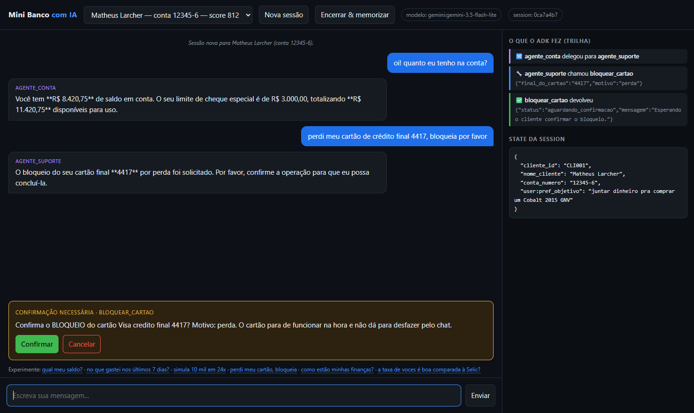
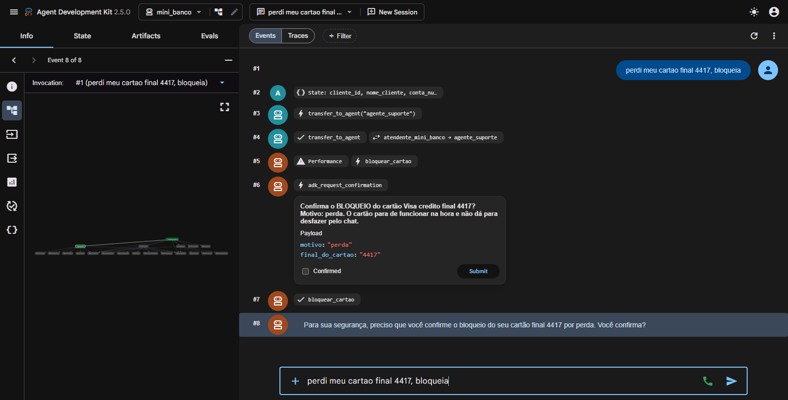
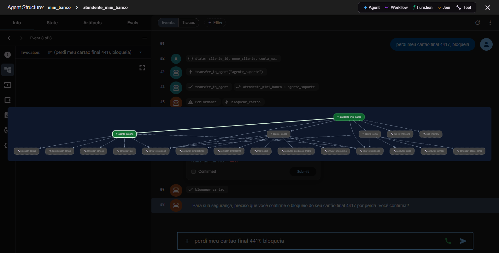

# Agent-MiniBanco

Um atendimento bancário por chat ("Mini Banco"), feito com **Google ADK**, para aprender multi-agent
na prática. Você conversa normalmente e vários agentes de IA se revezam nos bastidores.



## O que dá pra fazer

| você escreve | quem atende | o que acontece |
|---|---|---|
| "qual meu saldo?" | Agente de Conta | lê o saldo real no banco de dados |
| "no que gastei essa semana?" | Agente de Conta | extrato filtrado por período e categoria |
| "simula 10 mil em 24x" | Agente de Crédito | calcula parcela, juros e total |
| "quero contratar esse empréstimo" | Agente de Crédito | **pede sua confirmação** antes de contratar |
| "perdi meu cartão, bloqueia" | Agente de Suporte | **pede sua confirmação** antes de bloquear |
| "como estão minhas finanças?" | Workflow | dois agentes coletam em paralelo e um terceiro dá o parecer |
| "a taxa de vocês é boa?" | Agente de Crédito | busca Selic/CDI num servidor externo (MCP) |

Do lado direito da tela você vê, ao vivo, **qual agente atendeu, qual ferramenta rodou e
o que tem guardado na sessão**. É esse painel que ensina o ADK.

---

## Como rodar

**Precisa:** Python 3.11+ e uma chave de LLM.

```bash
# 1. instalar
python -m venv .venv
.venv\Scripts\pip install -r requirements.txt      # Linux/Mac: .venv/bin/pip

# 2. configurar a chave
copy .env.example .env                             # Linux/Mac: cp
#    abra o .env e preencha a chave do provider escolhido

# 3. criar o banco fictício
.venv\Scripts\python -m banco.seed

# 4. subir o chat
.venv\Scripts\python -m app.server
```

Abra **http://localhost:8010**.

### Qual chave usar

No `.env`, escolha **um**:

```bash
LLM_PROVIDER=gemini      # + GOOGLE_API_KEY    -> https://aistudio.google.com/apikey
LLM_PROVIDER=openai      # + OPENAI_API_KEY
LLM_PROVIDER=deepseek    # + DEEPSEEK_API_KEY
```

Se usar o Gemini gratuito, deixe `LLM_MAX_RPM=12` no `.env`: o plano grátis só permite
15 chamadas por minuto e cada mensagem sua gasta 3 ou 4. Com conta paga, ponha `0`.

---

## Rodar os testes

```bash
.venv\Scripts\python -m testes.teste_completo
```

Recria o banco e faz **60 verificações** conversando com o agente de verdade: cada tool,
a delegação entre agentes, Session, State, memória, MCP, o workflow, e as operações que
exigem confirmação (aceitando **e** recusando).

```
====================================================================
 RESULTADO: 60/60 em 255s
====================================================================
```

---

## Conferir que são agentes ADK de verdade

O Google ADK é uma **biblioteca que roda na sua máquina** — não é um serviço na nuvem.
Não existe painel do Google mostrando estes agentes (isso só existiria se fossem
publicados no Vertex AI Agent Engine). Mas o próprio ADK traz uma UI oficial de debug:

```bash
.venv\Scripts\adk web .        # http://localhost:8000
```

Ela lê o seu código, encontra o app `mini_banco` e mostra tudo o que acontece:



Repare que é a **própria interface do Google** desenhando:

- `#2 State:` — o State da sessão sendo preenchido
- `#3/#4 transfer_to_agent` — `atendente_mini_banco` **delegando** para `agente_suporte`
- `#5 bloquear_cartao` — a tool sendo chamada
- `#6 adk_request_confirmation` — o pedido de confirmação, com payload e botão Submit,
  renderizado nativamente pelo ADK

E o botão de grafo no topo desenha a árvore inteira, destacando em verde o caminho que
a conversa percorreu:



Quer conferir pelo terminal? A árvore sai direto do código:

```bash
.venv\Scripts\python -c "from mini_banco.agent import root_agent; print(root_agent.sub_agents)"
```

E o painel do **AI Studio** (aistudio.google.com) mostra as requisições que a sua chave
fez — é a prova de que o LLM foi chamado de verdade.

---

## Quero aprender o ADK

Leia nesta ordem:

1. **[docs/APRENDENDO_ADK.md](docs/APRENDENDO_ADK.md)** — 19 tópicos, cada um com o arquivo,
   o trecho de código e a explicação. Comece por aqui.
2. **[docs/RESUMO_ENTREVISTA_ADK.md](docs/RESUMO_ENTREVISTA_ADK.md)** — cola curta para decorar.
3. **[docs/ARQUITETURA.md](docs/ARQUITETURA.md)** — detalhes técnicos e decisões.

Dica: rode também a UI oficial de debug do ADK, que mostra o prompt cru enviado ao modelo:

```bash
.venv\Scripts\adk web .      # http://localhost:8000
```

---

## Como está organizado

```
banco/          banco SQLite fictício (clientes, contas, cartões, transações, empréstimos)
mini_banco/     >>> aqui mora o Google ADK <<<
  agent.py        agente principal (multi-agent)
  prompts.py      todas as instruções dos agentes
  config.py       qual LLM usar + política de retry
  limitador.py    segura as chamadas para não estourar a cota do LLM
  autenticacao.py coloca o cliente logado no State antes da conversa começar
  tools/          as ferramentas que consultam o banco
  sub_agents/     agente de conta, de crédito e de suporte
  workflows/      raio-x financeiro (Sequential + Parallel)
mcp_server/     servidor MCP externo (Selic, CDI, inflação)
app/            Runner, Session, State, memória + interface de chat
testes/         suíte ponta a ponta
docs/           APRENDENDO_ADK.md, RESUMO_ENTREVISTA_ADK.md, ARQUITETURA.md
```

> Os dados são **100% fictícios** e ficam num SQLite local. Nada aqui fala com banco real.
